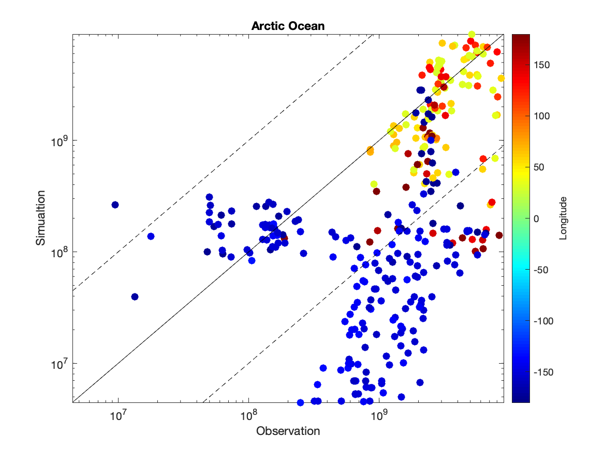
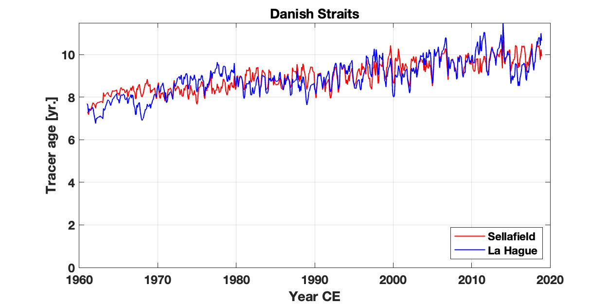
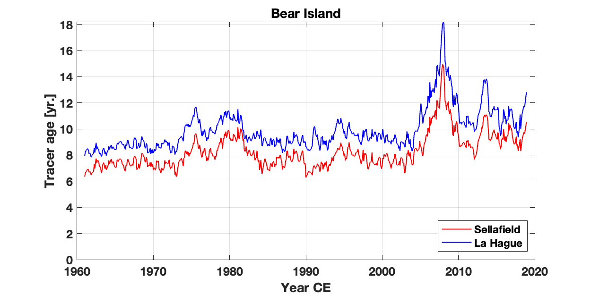
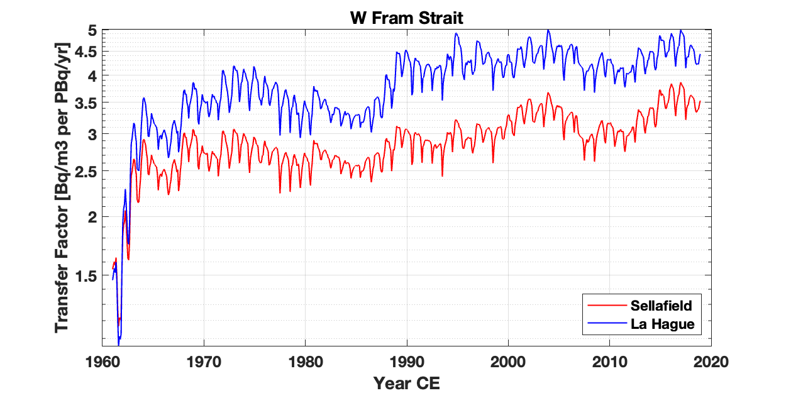

# Updates of NKS-B ANTROPIC project

## *Oct, 2023: WP1 - Hindcast simulation*

## 1. Methodology

### 1.1. Main tasks of WP1:
 1. Evaluate NorESM by the observations of radiotracers and chemical tracers; 
 2. Investigate historical hydrodynamics with evaluate modeling results

### 1.2. Model setup 
* **NorESM:** Ocean-ice configuration
* **Time period:** 1945 - near present

### 1.3. Tracer Setup
#### 1.3.1. Radiotracers:
* **Reprocessing plants:** liquid discharges from two European nuclear reprocessing plants and Sellafield and La Hague
 1. **Tc-99, I-129 & Cs-137:** documented discharge data for Sellafield since 1952 and for La Hague since 1966 (HELCOM, OSPAR, and RADD databases)
 2. **U-236:** a) documented discharge data for La Hague since 1966 (HELCOM databases);b) reconstructed discharges data for Sellafield and La Hague since 1971 (Castrillejo et al., 2020)

* **Global fallout:** atmospheric depostion from nuclear weapon testing
 * **Cs-137 & U-236:** resolved spatiotemporal deposition pattern (UNSCEAR 2000)

#### 1.3.2. **Vitual traers:**
* **Water masses in AO:** constant concentrations in entering water
 * Pacific water: 
 * Atlantic water (via Fram Strait & Barent Sea)
 * Fresh water
* **Point sources:** constent discharges
 * Sellafield
 * La Hague
 * Fukushima

## 2. Results

### 2.1. Radiotracer transport

#### 2.2.1 Surface distribution

| RP-derived Tc-99 | RP-derived I-129 |
| --- | --- |
| <video style="width:100%" controls src="./Updates_2023-10/02_video/hist_surf_trc_RPTc99_lite.mp4"/> | <video style="width:100%" controls src="./Updates_2023-10/02_video/hist_surf_trc_RPI129_lite.mp4"/> |

| RP-derived Cs-137 | GF-derived Cs-137 |
| --- | --- |
| <video style="width:100%" controls src="./Updates_2023-10/02_video/hist_surf_trc_RPCs137_lite.mp4"/> | <video style="width:100%" controls src="./Updates_2023-10/02_video/hist_surf_trc_GFCs137_lite.mp4"/> |

### 2.2. NorESM evaluation

#### 2.2.1 Scatter data

|  | Tc-99 (all basins) | I-129 (all basins) |
| --- | --- | --- |
| **Spatial distribution** |  |  |
| **Observation vs. simulation** |  |  |
| **Mean normalized bias** | **Overall (n=2238): 33.8%** <ul><li>Baltic Sea (n=480): 63.2% <li>Arctic Ocean (n=134, outliers excluded): 43.3% <li>**Nordic Seas (n=612): 3.4%** <li>North Atlantic (n=1011, outliers excluded): 39.1% | **Overall  (n=852): 11.2%** <ul><li>Baltic Sea (n=92): 45.3% <li>Arctic Ocean (n=323, outliers excluded): -38.8% <li>**Nordic Seas (n=179): 23.9%** <li>North Atlantic (n=225, outliers excluded): 73.6% |
| **Correlation coefficient** | **Overall (n=2238): 0.427** <ul><li>Baltic Sea (n=480): 0.427 <li>Arctic Ocean (n=134, outliers excluded): 0.906 <li>**Nordic Seas (n=612): 0.812** <li>North Atlantic (n=1011, outliers excluded): 0.292 | **Overall  (n=852): 0.795** <ul><li>Baltic Sea (n=92): 0.531 <li>Arctic Ocean (n=323, outliers excluded): 0.529 <li>**Nordic Seas (n=179): 0.830** <li>North Atlantic (n=225, outliers excluded): 0.757 |

|  | I-129 (North Atlantic) | I-129 (Arctic Ocean) |
| --- | :---: | :---: |
| **Latitude** |  |  |
| **Longitude** |  |  |
| **Depth** |  |  |
| **Year** |  |  |

**Summary:**

1. NorESM has the best performance in the Nordic Seas (low MNB and high r);
2. High NBs and low r are observed in the European marginal seas, such as the Danish Straits and the British coast 
3. Low NBs are observed in the deep water of the Canada Basin (probably due to slower advection in model).

#### 3.2.2 Temporal evolution

|  | Tc-99 | I-129 |
| --- | --- | --- |
| **Station location** |  |  |
| **Temporal evolution** |  |  |
| **Mean normalized bias** | <li>Danish Straits surf. (n=164): 39.7% <li>Danish Straits bo. (n=37): -19.2% <li>SW Norwegian Coast (n=81): 28.9% <li>NW Norwegian Coast (n=159): -38.3% <li>Barent Sea (n=42): 35.8% <li>Denmark Strait (n=33): -11.3% | <li>Danish Straits surf.(n=46): -23.2% <li>SW Norwegian Coast (n=19): -12.9% |
| **Correlation coefficient** | <li>Danish Straits surf. (n=164): 0.166 <li>Danish Straits bo. (n=37): 0.428 <li>SW Norwegian Coast (n=81): 0.418 <li>NW Norwegian Coast (n=159): 0.753 <li>Barent Sea (n=42): 0.681 <li>Denmark Strait (n=33): not corr. | <li>Danish Straits surf.(n=46): 0.753 <li>SW Norwegian Coast (n=19): 0.923 |

**Summary:**

1. Low r are observed at the stations of the European marginal seas.
2. MNBs are acceptable at all stations;

### 3.3 Point-source releases

#### 3.3.1 Spatial distribution

|  | Surf. tracer age | Surf. transfer factor (no decay) |
| --- | --- | --- |
| **Sellafield** | <video style="width:100%" controls src="./Updates_2023-10/02_video/hist_surf_RP_age_SF_lite.mp4"/> | <video style="width:100%" controls src="./Updates_2023-10/02_video/hist_surf_RP_dil_SF_lite.mp4"/> |
| **La Hague** | <video style="width:100%" controls src="./Updates_2023-10/02_video/hist_surf_RP_age_LH_lite.mp4"/> | <video style="width:100%" controls src="./Updates_2023-10/02_video/hist_surf_RP_dil_LH_lite.mp4"/> |

#### 3.3.2 Temporal evolution

|  | Surf. tracer age | Surf. transfer factor (no decay) |
| --- | --- | --- |
| **Station location** |  |  |
| **Danish Straits** |  |  |
| **SW Norwegian Coast** |  |  |
| **NW Norwegian Coast** |  |  |
| **Bear Island** |  |  |
| **E Fram Strait** |  |  |
| **W Fram Strait** |  |  |
| **E Greenland Coast** |  |  |
| **S Greenland Coast** |  |  |

**Summary:**

1. Dischages from La Hague has 1 year more transit time than thoes from Sellafield.
2. A branch of Sellafield discharges transport across the North Atlantic reaching S Greenland directly.

### 3.5 Water masses in Arctic (to be updated)

## 4. Next Step

1. Re-run WP1 for the vitual tracers of AO water masses;
2. Re-run WP1 for U-236 discharges from RPs;
2. Prepare source-term files and move on to WP2.
